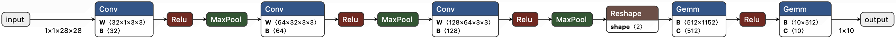
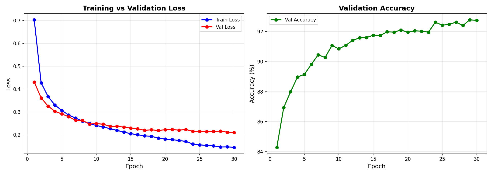
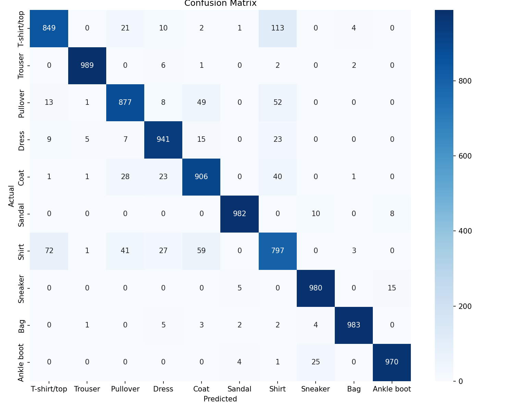

# Fashion MNIST Image Recognition

Deep learning image classifier for the Fashion-MNIST dataset. Achieved model improvement from 84.23% to 92.74% test accuracy through 
regularization techniques and architecture improvements.

## Data

Fashion-Mnist dataset, 60.000 training images, 10.000 test images with 10 classes. Each image is a 28x28 grayscale image, for more information see 
the [fashion-mnist repository](https://github.com/zalandoresearch/fashion-mnist) of Zalando research.

## Architecture

To achieve the best accuracy different model architectures have been tried, all of them are a 3-layer convolutional neural network
(for more details to the different models see this [file](architectures.md)). The model that achieved the highest accuracy has the following architecture:

It is a 3-layer CNN with 1 -> 32, 32 -> 64 and 64 -> 128 channels and each one with a 3x3 kernel. Each layer is batch normed with the corresponding
number of output channels, activated through Relu and pooled by 2x2 max pooling. After reshaping follow two fully connected layers with 1152 -> 512 -> 10.
The first to convolutional layers have a dropout rate of 0.1, the third of 0.15 and the first fully connected layer of 0.3. The model trains with a batch
size of 64, 30 epochs and a starter learning rate of 0.001 with a ReduceLROnPlateau scheduler. The criterion is a CrossEntropyLoss while the optimizer is 
stochastic gradient descent with weight decay.

The final model tends to overfit lightly in the last epochs though the difference in loss stays within 0.0695:

While the footwear is classified with high confidence, shirts overlap with classes that contain similar features:

## Experiments

| Nr | Model     | Augmentation                                                           | LR               | Epochs | Train Acc | Test Acc | Notes                                                             |
|----|-----------|------------------------------------------------------------------------|------------------|--------|-----------|----------|-------------------------------------------------------------------|
| 1  | CNN-small | None                                                                   | 0.001            | 10     | 85.37%    | 84.23%   | Baseline, worst: Shirt (51.30%)                                   |
| 2  | CNN-small | RandomAffine/Erasing on Classes `T-shirt`, `Pullover`, `Coat`, `Shirt` | 0.001            | 10     | 83.19%    | 82.40%   | Fashion MNIST dataset too clean, augmentation only hurts          |
| 3  | CNN-mid   | None                                                                   | 0.001            | 10     | 87.01%    | 86.07%   | Worst: Shirt (54.50%), no plateau in loss graph                   |
| 4  | CNN-mid   | None                                                                   | 0.001            | 20     | 90.14%    | 88.70%   | Loss plateaus at around 0.33-0.31                                 |
| 5  | CNN-big   | None                                                                   | 0.001            | 20     | 89.28%    | 87.84%   | Light overfitting                                                 |
| 6  | CNN-big   | None                                                                   | 0.001            | 20     | 87.60%    | 86.25%   | Added dropout (conv: 0.2, fc: 0.4), wrong dropout for conv no 2d  |
| 7  | CNN-big   | None                                                                   | 0.001            | 20     | 88.25%    | 87.08%   | Changed to right conv dropout, added weight decay on optimizer    |
| 8  | CNN-big   | None                                                                   | 0.001 + schedule | 25     | 85.50%    | 84.76%   | Raised epochs and added lr scheduler, batch to 128                |
| 9  | CNN-big   | None                                                                   | 0.001 + schedule | 25     | 89.04%    | 87.91%   | dropped batch back to 64, too much regularization?                |
| 10 | CNN-mid   | None                                                                   | 0.001 + schedule | 25     | 90.21%    | 88.46%   | no dropout                                                        |
| 11 | CNN-mid   | None                                                                   | 0.001 + schedule | 25     | 89.99%    | 88.38%   | fc dropout 0.2                                                    |
| 12 | CNN-mid   | None                                                                   | 0.001 + schedule | 25     | 99.76%    | 91.78%   | batch normalization, strong overfitting                           |
| 13 | CNN-mid   | None                                                                   | 0.001 + schedule | 20     | 95.86%    | 92.37%   | small conv (0.1) and fc (0.2) dropout                             |
| 14 | CNN-mid   | None                                                                   | 0.001 + schedule | 30     | 97.42%    | 92.85%   |                                                                   |
| 15 | CNN-mid   | None                                                                   | 0.001 + schedule | 25     | 98.01%    | 92.72%   | dropped batch size to 32, bigger overfit                          |
| 16 | CNN-mid   | None                                                                   | 0.001 + schedule | 30     | 96.81%    | 92.74%   | small dropout changes, batch back to 64, less overfit than Nr. 14 |

## Key Learnings

## Installation and Usage